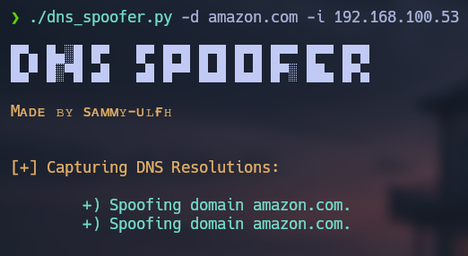
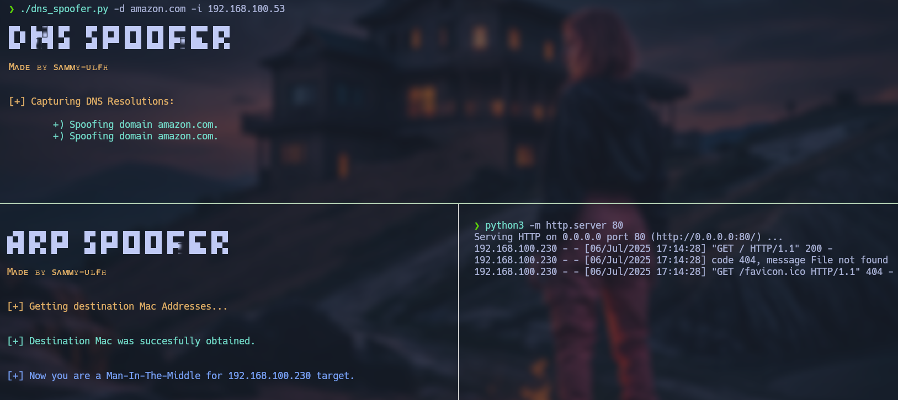
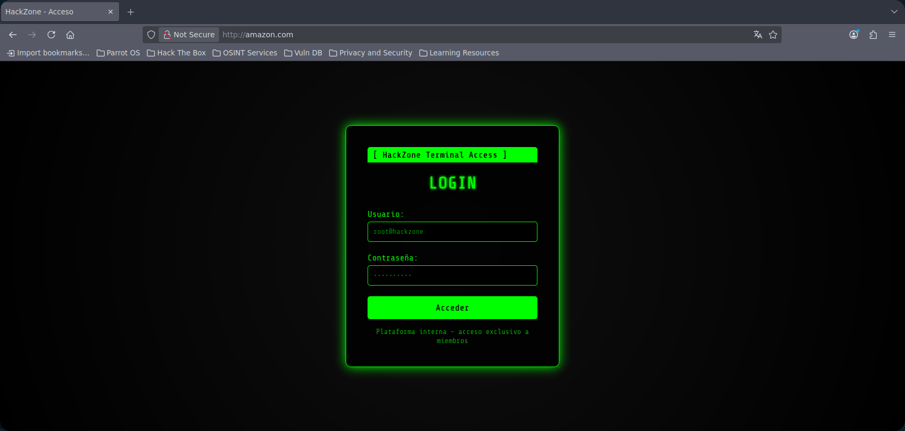

# dns_spoofer

<p align="center">
    
</p>

**DNS Spoofer** is a tool that captures and modifies **DNS** traffic from a target device. You can use it by providing the **domain** argument to spoof and the **ip-server** argument to specify the ip address for redirection.

<p align="center">
    
</p>

## Table of contents

- [First stepts](#what-do-i-need-to-run-it)
- [Neccesarry steps before running](#how-does-it-work)
- [How to run it](#how-do-i-use-it)

## What do I need to run it?

1. First, clone the repository:

    ```git
    git clone https://github.com/sammy-ulfh/dns_spoofer.git
    ```

2. Then, navigate to the **dns_spoofer/script** directory.

3. Next, install required libraries using pip:

    ```pip3
    pip3 install -r requirements.txt
    ```
3. Finally, add some rules using the **iptables** tool:

    ```shell
    iptables -I INPUT -j NFQUEUE --queue-num 0
    iptables -I OUTPUT -j NFQUEUE --queue-num 0
    iptables -I FORWARD -j NFQUEUE --queue-num 0
    iptables --policy FORWARD ACCEPT
    ```
    <br/>
    Then, set the value 1 in the **ip_forward** file to enable ip forwarding:

    ```shell
    echo 1 > /proc/sys/net/ipv4/ip_forward
    ```
    <br/>
    All of these rules redirect the traffic to an NFQUEUE, and we can bind to the queue using its number - in this case 0.


## How does it work?

This **DNS Spoofer** tool captures and modifies DNS traffic when a target device attemps to resolver a domain name, with the goal of redirecting it to a server under your control.

It was built to capture traffic while performing ARP spoofing, allowing you to intercept and analize all the traffic that your target is accessing. You can complement the **[arp_spoofing](https://github.com/sammy-ulfh/arp_spoofer)** tool with this one to capure all DNS request from your target and retirect them to your own server.

How it works on your device:<br/>

<p align="center">
    
</p>

How it works on a target device:<br/>

<p align="center">
    
</p>


## How do I use it?

**NOTE:** Root privileges are required.

- **Domain:**
    Provide a domain name or a list of domain names separed by commas using the **-d / --domain** argument.<br/>
    Example: -d Hack4u.io
    Example: -d Hack4u.io,amazon.com

- **Your Own Server Ip:**
    Provide your own server's IP using the **-i / --ip-server** argument.<br/>
    Example: -i 120.180.90.12

